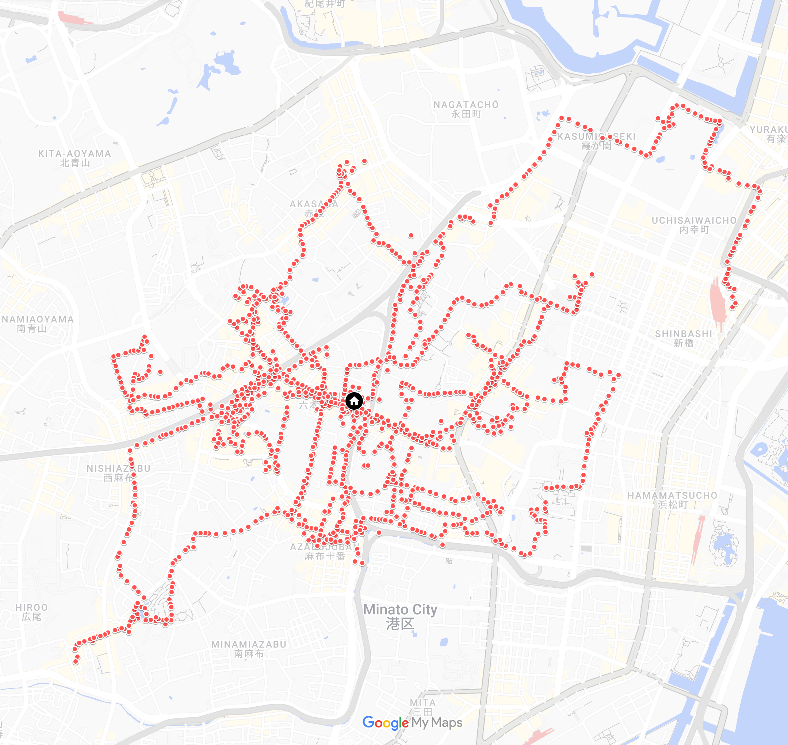

# Google-Takeout-locations-JSON-into-CSV-for-Google-MyMaps

This guide will walk you through the process of importing your Google location history to Google MyMaps using a script and `Records.json` file exported from Google Takeout.

## Prerequisites
The ability to run a Node.js script is required. Install Node.js and npm (comes with Node.js) before proceeding. 





## Steps

### Exporting your Location History:

1. Go to [Google Takeout](https://takeout.google.com/)
2. Click "**Deselect All**"
3. Only tick the checkbox '**Location History**'
4. Click "**Next Step**", and then "**Create Export**"

### Setting up the Project:

5. Once the export is complete, find the `Records.json` file within the downloaded export. Move (drag-and-drop) the file into the root directory of this project

### Installing the Dependencies:

6. Open your terminal in the project's root directory, and run the following command to install the necessary dependencies:
    ```
    npm install
    ```
### Running the Script:

7. Run the script by typing and executing the following command in the terminal:
    ```
    node index.js
    ```
This will result in an output file named `output.csv` being generated in the project's root directory.

### Uploading to Google MyMaps:

8. Go to [Google MyMaps](https://www.google.com/mymaps)
9. Import the generated `output.csv` file

You should now have your location history visible in Google MyMaps! Enjoy!

